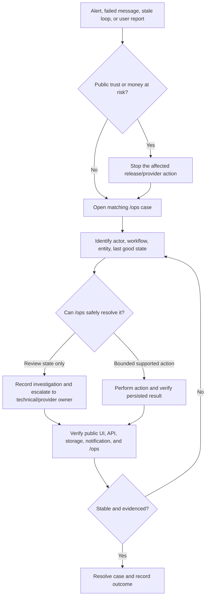

# DTD Launch Operator Flow Manual

**Purpose:** teach the owner-operator how Dog Trainers Directory (DTD) behaves after launch, what each user does, what the automation does next, what appears in `/ops`, and where intervention is required.

**Audit date:** 19 September 2026 (Australia/Melbourne)
**Scope:** current main DTD application, separate The First Leash education application, active top-level documentation, current code, automated tests, and a read-only production/runtime inspection. The documentation archive was not opened.
**Current readiness verdict:** **not operationally ready for unattended launch acceptance.** Public browsing and the principal application routes work, but the current `/ops` snapshot reports stale autonomous loops, 81 open cases, 16 failed messages, 21 open reactivation candidates, and an `attention_needed` readiness state.

## 1. How to read this manual

| Mark | Meaning |
|---|---|
| **Working** | The UI/API path exists, the expected persistence or response exists, and automated evidence covers the important branches. |
| **Partial** | A meaningful part works, but one or more required actor, notification, fallback, or operator steps are missing or misleading. |
| **Gated** | Deliberately disabled until a named launch or provider condition is met. Do not work around the gate. |
| **Missing/drift** | Promised by an active specification but not implemented, or the documentation and product disagree. |

“Working” does not mean “healthy in production.” Automated tests prove code behaviour; `/ops` and provider evidence prove whether the live workflow is currently operating.

## 2. Whole-site operating picture

```mermaid
flowchart LR
    subgraph Owners[Dog owner]
      O1[Browse directory or suburb page]
      O2[Describe dog and location]
      O3[Receive up to 3 matches]
      O4[Open trainer profile]
      O5[Send protected enquiry]
      O6[Trainer contact is released]
      O7[T+7 outcome follow-up]
    end

    subgraph Trainers[Trainer or business]
      T1[Existing profile or self-submission]
      T2[Quality gate: publish or hold]
      T3[Claim by email OTP]
      T4[Free Core profile]
      T5[Choose Pro, suburb, or Melbourne-Wide]
      T6[Stripe checkout and webhook]
      T7[Billing portal or reactivation]
    end

    subgraph Systems[Autonomous system]
      S1[(MongoDB records)]
      S2[Ranking and matching]
      S3[Email delivery and retries]
      S4[Verification and health loops]
      S5[Sponsor inventory]
      S6[Trial day-23 warning]
    end

    subgraph Operator[Owner-operator]
      P1[/ops Overview]
      P2[Work Queue]
      P3[Trainer Supply]
      P4[Messages]
      P5[Billing and Reactivation]
      P6[System Activity]
      P7[Recent Changes]
    end

    subgraph Education[Separate education product]
      E1[DTD education link]
      E2[learn.dogtrainersdirectory.com.au]
      E3[Return to Find a Trainer]
    end

    O1 --> O2 --> O3 --> O4 --> O5 --> O6 --> O7
    O2 --> S2
    O5 --> S1
    O5 --> S3
    T1 --> T2 --> T3 --> T4 --> T5 --> T6 --> T7
    T2 --> S1
    T6 --> S1
    T6 --> S5
    S1 --> P1
    S3 --> P4
    S4 --> P6
    S5 --> P5
    S6 --> P4
    P1 --> P2 --> P3 --> P4 --> P5 --> P6 --> P7
    O1 -. learn .-> E1 --> E2 --> E3 --> O1
```

### Responsibility rule

Every complete DTD flow must cover all five layers:

1. user-facing page or trigger;
2. API or background service;
3. persisted state;
4. notification, retry, suppression, or safe fallback; and
5. visible evidence in `/ops` when an operator may need to act.

## 3. Dog-owner flows

### O1 — Browse and filter the directory — **Working**

1. Owner opens `/`, `/trainers`, or `/melbourne/:suburb`.
2. The public configuration and trainer catalogue load.
3. Owner filters or browses published trainers.
4. Owner opens `/t/:id` or `/trainers/:id`.
5. Only public trainer fields are returned; private ABN and source evidence remain outside the public payload.
6. If a suburb has no suitable local result, the experience should broaden to nearby or Melbourne-wide supply rather than expose an empty dead end.
7. Operator checks geographic coverage and unpublished/held inventory under `/ops` → **Trainer Supply**.

**Current evidence:** home, directory, a live trainer profile, and Richmond suburb page all returned HTTP 200 in desktop inspection; core routes also rendered on mobile without browser-console errors.

### O2 — Guided matching — **Partial**

1. Owner enters a free-text description of the dog’s needs.
2. Owner may add a suburb.
3. Owner gives the required consent.
4. Frontend sends `POST /api/match`.
5. Backend excludes paid fields from fit scoring and scores suitability.
6. The system returns at most three matches.
7. Paid status may only break a named five-point fit tie; it is not part of the diagnostic fit score.
8. A match record is persisted for attribution and downstream engagement.
9. If matching fails, the page shows a safe error rather than inventing a result.

**Why partial:** the current product is a compact text-and-suburb form, not the multi-step diagnostic wizard described in older target-state material. The underlying fit-first boundary is implemented and tested.

### O3 — Protected enquiry and contact release — **Working**

1. Owner opens a trainer profile.
2. Owner chooses the contact/enquiry action.
3. Owner supplies contact details and an enquiry description.
4. Frontend sends `POST /api/intros`.
5. Backend rate-limits and suppresses duplicate or suspicious submissions.
6. The intro is persisted.
7. The trainer is notified by email; delivery attempts and failures are recorded.
8. Trainer contact details are released to the owner only after the protected action succeeds.
9. Engagement events and conversions can be associated with the intro.
10. Operator sees intro/fraud/message exceptions in `/ops` → **Work Queue** and **Messages**.

**Degraded branches:** missing trainer email is skipped and recorded; provider failure is fail-soft and visible; duplicate/rate-limited requests do not create another valid intro.

**Known omission:** there is no corresponding owner confirmation email, despite that expectation appearing in active documentation.

### O4 — Outcome follow-up — **Partial**

1. A successful intro receives a signed follow-up token.
2. The system schedules/sends the T+7 outcome request.
3. Owner opens `/follow-up/:token`.
4. Owner selects `hired`, `still_deciding`, or `need_another_match`.
5. Frontend sends `POST /api/follow-up/:token/outcome`.
6. The outcome/conversion state is persisted.
7. `need_another_match` returns the owner to the matching entry point.
8. Invalid or expired tokens fail closed with a safe page.
9. Delivery and lifecycle exceptions appear in `/ops`.

**Why partial:** the T+7 path exists and is tested; the promised T+14 verified-review invitation and review-writing flow were not found.

### O5 — Waitlist fallback — **Working but normally dormant**

1. If public matching is disabled, Home may offer the owner waitlist.
2. Owner supplies contact, suburb/region, dog details, and consent.
3. Frontend sends `POST /api/owner-waitlist`.
4. Backend validates, deduplicates, and persists the lead.
5. Invalid, duplicate, or rejected entries receive a bounded response.
6. Operator can review waitlist demand against supply in `/ops`.

**Current mode:** production reports `live_matching`, so this is a resilience path, not the primary owner journey.

### O6 — Education handoff — **Partial**

1. Owner selects The First Leash from DTD.
2. `/the-first-leash/*` and `/education/*` redirect to `https://learn.dogtrainersdirectory.com.au/`.
3. The separate application presents life-stage learning content.
4. Its “Find a Trainer” bridge returns the owner to DTD.
5. No sensitive owner data should cross the boundary without explicit consent.

**Current evidence:** the redirect reached the separate education site and rendered “Select Your Dog’s Life-Stage.”

**Why partial:** the main repository still contains an unused `POST /api/first-leash` lead endpoint/model and stale First Leash campaign copy. That contradicts the approved “bridge only; no duplicate education content or API” target state.

## 4. Trainer and business flows

### T1 — Self-submit a listing — **Working**

1. Trainer opens `/submit`.
2. Trainer enters identity, contact, business, service, and locality information and accepts the required terms.
3. Frontend validates required fields.
4. Frontend sends `POST /api/submissions`.
5. Backend normalises the record, checks duplicates, and evaluates quality/confidence.
6. Qualified submissions are auto-published; uncertain submissions are held.
7. Submission and trainer state are persisted.
8. Trainer receives a status link.
9. Operator sees held/duplicate/suspicious cases in `/ops` → **Work Queue** and **Trainer Supply**.

### T2 — Check submission status and remediate — **Working with copy drift**

1. Trainer opens `/submit/status/:submissionId`.
2. Page loads submission, publication, verification, and blocking state.
3. Trainer follows the available claim, billing, reactivation, or support action.
4. Invalid IDs fail closed.
5. Changes and exceptions remain visible in `/ops`.

**Copy issue:** this public page exposes an internal numeric “confidence” percentage. The approved public language should explain the review state in human terms, not reveal internal scoring.

### T3 — Claim an existing profile — **Partial**

1. Trainer starts claim from a trainer profile.
2. Frontend sends `POST /api/trainers/:id/claim` using the listed email channel.
3. Backend validates the trainer and claim state.
4. A hashed, expiring OTP is persisted and emailed.
5. Trainer enters the OTP.
6. Frontend sends `POST /api/claim/verify`.
7. Backend enforces expiry, retry/lockout, replay protection, duplicate-claim prevention, and dispute holds.
8. Successful verification marks the profile claimed and issues a short-lived claim session.
9. Trainer can continue to billing as Free Core or select a paid plan.
10. Claim failures and disputes are visible in `/ops`.

**Why partial:** email OTP is robustly covered; SMS claim returns a controlled 503/fallback because Firebase Phone Auth is not implemented. A separate welcome/claim-success email was not found.

### T4 — Choose a paid plan — **Gated for live charging**

1. Claimed trainer opens `/trainer/billing` using a signed action token or claim session.
2. Page displays the profile, billing readiness, plan, trial, and eligible sponsor inventory.
3. Trainer chooses one of the canonical plans:
   1. Free/Core — A$0;
   2. Pro — A$19/month or A$149/year;
   3. Suburb Sponsor — A$39/month per eligible suburb;
   4. Melbourne-Wide — A$199/month.
4. There is **no A$99 Regional Sponsor tier**.
5. Suburb Sponsor enforces two active sponsors per suburb and four sponsored suburbs per business.
6. Frontend sends `POST /api/trainer/billing/checkout`.
7. Backend validates identity, consent, plan, inventory, and trial eligibility before creating Stripe Checkout.
8. Stripe completes payment; webhook processing updates subscription and sponsor inventory idempotently.
9. Checkout/provider failure creates review evidence and leaves the trainer in a safe non-upgraded state.
10. Operator reviews exceptions in `/ops` → **Billing & Reactivation** and **Messages**.

**Current gate:** Stripe remains in test mode. Live payment activation and the approved trial cohort must be switched as one controlled release event.

### T5 — 30-day Pro trial — **Implemented, cohort gated**

1. Eligibility requires Stripe live mode plus the explicit live-mode cohort timestamp.
2. Eligible first-time Pro checkout creates a genuine 30-day Stripe subscription trial.
3. Stripe owns the trial dates; webhook state is persisted.
4. Repeat trials are prevented.
5. On day 23, the warning job sends “trial ends in 7 days” messaging.
6. Warning delivery is idempotent and appears in `/ops` messages/system evidence.
7. Trainers created before the cohort timestamp are outside the trial cohort.

**Current state:** implementation and warning tests pass; the live cohort is inactive while Stripe is not live.

### T6 — Manage, cancel, or repair billing — **Working for authenticated self-service; operator actions partial**

1. Trainer reopens `/trainer/billing` through a signed link/session.
2. The page restores same-browser billing authentication after returning from Stripe using `sessionStorage`; tokens are not placed in Stripe return URLs.
3. Trainer can request billing-profile repair/reconnection.
4. Trainer can open the Stripe customer portal.
5. Stripe owns payment-method updates and ordinary cancellation.
6. Webhooks persist subscription changes and release affected sponsor inventory.
7. Failures enter `/ops` as billing/message cases.

**Operator limitation:** `/ops` currently changes case-review state only. It does not expose the approve/reject/merge/delist/cancel/refund controls promised by active operations specifications.

### T7 — Refund request — **Gated/partial**

1. Trainer contacts support and identifies the charge.
2. Monthly-plan eligibility is 14 days from the first billing cycle; annual Pro eligibility is 30 days.
3. The monthly rule also covers Melbourne-Wide monthly subscriptions.
4. Backend validates the request through `POST /api/oversight/subscriptions/refund`.
5. Refund execution is disabled by default and must remain disabled until launch gates pass.
6. A successful future refund must update Stripe, persist the audit event, and release associated sponsor inventory where applicable.
7. Operator verifies the result under billing, message, and audit evidence.

**Current gap:** there is no refund/cancel action in `/ops`, so the documented “one-click refund” operating flow does not exist.

### T8 — Reactivate a listing — **Partial; emailed link is broken**

1. The reactivation loop identifies unpublished/low-confidence or inactive candidates.
2. Candidate and reasons are persisted.
3. `/ops` generates a signed operator reactivation link.
4. The automated trainer email should send that same signed link.
5. Trainer opens `/trainer/reactivate` and sees blockers.
6. Trainer repairs profile/billing issues, then submits reactivation.
7. Backend re-evaluates and either publishes or leaves the listing held.
8. Result is persisted and visible in `/ops`.

**Current defect:** the automated email sends `/trainer/reactivate?trainerId=...` without the required signed `token`. The page/API correctly reject that link. The `/ops`-generated link is signed, so operator-assisted use can work, but the autonomous trainer journey cannot.

## 5. External contributor and supply flows

### X1 — Controlled trainer ingestion — **Gated**

1. Operator/provider supplies a pre-approved, lawful source URL.
2. Source contract and approval are checked.
3. Gemini URL Context may extract facts from that authorised URL.
4. ABR and canonical identifiers are checked.
5. Phone/domain/ABN and fuzzy-local matching deduplicate records.
6. Suppression and delisting rules are applied.
7. Quality gate publishes qualified records and holds uncertain records.
8. Provenance remains private and is visible in `/ops`.

**Do not substitute:** Google Search grounding or Places must not become an autonomous URL-harvesting database without current terms review and explicit source approval.

**Current state:** zero enabled sources and a suppressed/stale source-ingestion state were visible in the runtime snapshot. This is a deliberate authority gate, but it means autonomous supply growth is not operating.

### X2 — Canonical suburb catalogue — **Implemented asset; operational coverage incomplete**

1. The canonical asset contains 539 Greater Melbourne delivery localities.
2. Seeding is idempotent.
3. `/api/config` reads the complete `suburbs` collection when seeded and falls back safely if needed.
4. Directory, submissions, inventory, and future SEO should use the same canonical names.
5. Operator monitors live trainer coverage per locality in **Trainer Supply**.

**Current limitation:** the asset exists, but active documentation still records SEO/indexation and sitemap work as incomplete.

## 6. Autonomous system flows

| ID | Automation | Expected steps | Operator evidence | Current state |
|---|---|---|---|---|
| A1 | Ranking | read published trainers → calculate fit/outcome order → apply only permitted tie treatment → persist ranking evidence | System Activity, trainer order | **Partial:** implementation exists; live loop was stale. |
| A2 | Verification | sweep profiles → re-check quality/state → publish, hold, or flag → persist audit | Trainer Supply, Work Queue, Recent Changes | **Partial:** implementation/tests exist; live loop was stale. |
| A3 | Discovery/ingestion | read approved sources → extract → ABR/dedupe/suppress → quality gate → publish/hold | Trainer Supply, source cases, System Activity | **Gated:** no approved enabled source; live state suppressed/stale. |
| A4 | Intro notification | persist intro → notify trainer → retry → record sent/failed/skipped | Messages, Work Queue | **Working with live failures:** 29 sent, 16 failed, 1 skipped across current message evidence. |
| A5 | T+7 outcome | identify due intros → send signed follow-up → persist response → conversion/next-match branch | Messages, Work Queue | **Working/partial:** T+7 exists; T+14 reviews absent. |
| A6 | Health | inspect workflow/provider/queue health → classify issue → create case | Overview, System Activity, Work Queue | **Partial:** code exists; live health loop was stale. |
| A7 | Reactivation routing | find candidates → notify → signed action → re-score → resolve/hold | Billing & Reactivation, Messages | **Broken autonomous link:** email omits token. |
| A8 | Sponsor inventory | reserve atomically → activate from webhook → enforce caps/rotation → expire/release → audit | Billing & Reactivation, inventory cases | **Partial:** backend/tests exist; this loop is scheduled in the engine but omitted from `/ops` loop interval/status reporting. |
| A9 | Stripe webhook | verify signature → deduplicate event → update subscription/inventory → audit exception | Billing & Reactivation, Recent Changes | **Implemented; live charging gated.** |
| A10 | Pro trial warning | find eligible day-23 trials → send once → persist delivery | Messages, System Activity | **Working in code:** live snapshot was fresh/OK; cohort inactive. |

## 7. The operator’s exact `/ops` workflow

### Every operating session

1. Open `/ops` and authenticate with the operator passcode.
2. Open **Overview**.
3. Read launch phase, readiness, blocker, and recommendation before looking at totals.
4. If readiness is `attention_needed`, do not infer health from a green test run or a working public page.
5. Open **Work Queue**.
6. Start with high-severity and oldest detected cases.
7. Open the case details; confirm actor, workflow, source references, reason codes, and recommended next step.
8. Record only the truthful review state: acknowledge, investigate, monitor, resolve, defer/dismiss where offered, or escalate.
9. Remember: changing a case state records operator review; it does not repair the underlying profile, provider, payment, or automation.
10. Open **Trainer Supply**.
11. Check live/hidden/unverified totals, held submissions, suburb coverage, and geography gaps.
12. Open **Messages**.
13. Inspect failed deliveries before assuming any downstream trainer/owner action occurred.
14. Open **Billing & Reactivation**.
15. Review payment/webhook exceptions, sponsor capacity, and open reactivation candidates.
16. Open **System Activity**.
17. Compare every loop’s last run with its expected cadence; stale is an incident, not a cosmetic warning.
18. Open **Recent Changes**.
19. Confirm important operator/system actions produced an audit record.
20. Leave each unresolved item in an accurate queue state and escalate technical/provider work outside `/ops` when required.

### Daily launch-period checklist

- Confirm readiness is not `attention_needed`.
- Confirm no loop is stale or repeatedly failing.
- Review failed messages and trust-impacting missed notifications.
- Review newly held submissions and ownership disputes.
- Review billing/webhook exceptions and sponsor reservations.
- Confirm the public directory and one trainer profile load.
- Confirm the education bridge reaches the separate education site.

### Weekly checklist

- Compare live trainer count with suburb coverage, not only total records.
- Review unresolved and repeatedly reopened cases.
- Review claim disputes, fraud suppression, and delisting evidence.
- Check subscription, sponsor, and trial-warning trends.
- Confirm source approvals before enabling any ingestion feed.
- Confirm recent changes are attributable and reversible.
- Check backups/provider dashboards under their separate runbooks; `/ops` is evidence, not a replacement for infrastructure administration.

### Incident response



## 8. What the operator must not do

- Do not manually choose trainer matches for owners.
- Do not edit production database rows to make a case disappear.
- Do not treat an acknowledged/resolved `/ops` label as proof the underlying failure was repaired.
- Do not enable Stripe live mode without activating the approved Pro-trial cohort anchor in the same controlled release.
- Do not execute refunds while the refund gate is disabled.
- Do not expose tokens, ABN evidence, source provenance, or private owner/trainer data publicly.
- Do not activate a discovery source that lacks explicit source authority.
- Do not use Google Search grounding or Places as an unapproved autonomous acquisition database.
- Do not reintroduce education curriculum into the main DTD repository; the main product is a bridge to the separate education app.
- Do not trust “tests pass” as evidence that scheduled workers, email, Stripe, or production data are healthy.

## 9. Current runtime snapshot and launch blockers

The read-only snapshot inspected on 19 September 2026 reported:

| Signal | Observed state | Operator meaning |
|---|---:|---|
| Launch phase | `live_matching` | Public matching is the intended primary owner journey. |
| Readiness | `attention_needed` | Launch acceptance is not clean. |
| Recommendation | `resolve_blockers_and_continue_supply_first` | Resolve current exceptions before scaling demand. |
| Work-queue cases | 81 | Current workload exceeds the intended lightweight weekly operating model. |
| Case states | 49 detected, 29 notified, 3 monitoring | Most cases are not resolved. |
| Trainer records | 45 total | Supply remains early-stage. |
| Public trainer records | 34 | 11 records are not public. |
| Integrity | 9 verified, 25 unverified, 11 hidden | Verification and supply quality remain material. |
| Submissions | 11 auto-published, 4 auto-held, 0 pending | Quality gate is active; held records need review. |
| Messages | 29 sent, 16 failed, 1 skipped | Failed delivery must be triaged before trusting lifecycle completion. |
| Reactivation | 21 open candidates | The lifecycle queue is material, and emailed links are currently defective. |
| Sponsor inventory | 0 active, 0 reserved | Paid sponsor operation is not live. |
| Source ingestion | 0 enabled sources | Automated acquisition is gated. |
| Loop health | most core loops last ran 9–10 September; verification/source/reactivation evidence dated 13 July; Pro trial warning fresh on 18 September | Core automation is stale even though the warning job is current. |

### Priority defects before unattended launch acceptance

1. **P0 — Restore and prove autonomous loop cadence.** Determine why most loop evidence is stale, run the correct deployment/scheduler path, and verify fresh persisted and `/ops` timestamps.
2. **P0 — Repair the trainer reactivation email link.** Issue and include the required signed token; test open, expiry, replay/invalid, re-score, and `/ops` closure.
3. **P1 — Triage failed messages and the 81-case queue.** Separate historic noise from active trust-impacting failures; do not bulk-resolve without evidence.
4. **P1 — Remove remaining main-repository education residue.** Delete the unused `/api/first-leash` capture path/model and replace stale campaign education copy with a clean external bridge.
5. **P1 — Reconcile `/ops` promises with safe reality.** Either implement the explicitly approved bounded actions with audit/confirmation or correct active specs; do not imply refund/cancel/merge/delist controls exist.
6. **P1 — Remove internal confidence scores from trainer-facing copy.** Retain scores privately for quality and operations.
7. **P1 — Surface sponsor inventory automation health.** Add its cadence/status to `/ops` or explicitly document why it is event-only.
8. **P2 — Complete missing lifecycle communications.** Owner intro confirmation, trainer claim-success message, and T+14 verified review invitation.
9. **P2 — Decide/implement SMS claims only if still required.** Until then, label email OTP as the sole supported claim route and remove “configured” overclaims.
10. **P2 — Finish SEO/indexation workflow.** Implement truthful index/noindex, sitemap, canonical, and inventory thresholds before marketing citywide SEO reach.
11. **P2 — Reconcile active documentation.** The master/automation documents still contain old A$99 Regional Sponsor, paid-fit scoring, “3 to 5” caps, approximate suburb counts, and unimplemented integration/action claims. The reconciled target state and current code take precedence.

## 10. Verification record

- Read-only desktop route inspection: all enumerated SPA routes returned HTTP 200; deliberately invalid token/ID routes rendered safe error pages and logged expected 404 network responses.
- Read-only mobile inspection: core public routes rendered without browser-console errors.
- Separate education handoff: DTD redirect reached `learn.dogtrainersdirectory.com.au`.
- Backend targeted workflow suite: **179 passed**.
- Frontend suite: **25 passed across 8 suites**; tests emit React `act(...)` warnings that should be cleaned up, but no test failed.
- Production frontend build: **compiled successfully**.
- No production data, provider settings, billing state, case state, or deployment was changed by this audit.

## 11. Operator acceptance rule

DTD is ready for unattended operation only when all of the following are evidenced together:

1. public owner, trainer, and education routes work on desktop and mobile;
2. each money, identity, contact, and publication flow passes its happy and degraded branches;
3. core loops are fresh against their actual cadence;
4. failed delivery and high-severity queues are within a deliberately accepted operating threshold;
5. every action requiring attention is visible and understandable in `/ops`;
6. `/ops` claims only controls it really provides;
7. Stripe/provider/source gates reflect the real live state;
8. a complete action is verified through UI → API/service → stored state → notification/fallback → `/ops` evidence; and
9. remaining exceptions are explicitly accepted by the owner, not hidden by stale documentation or a green unit-test result.
