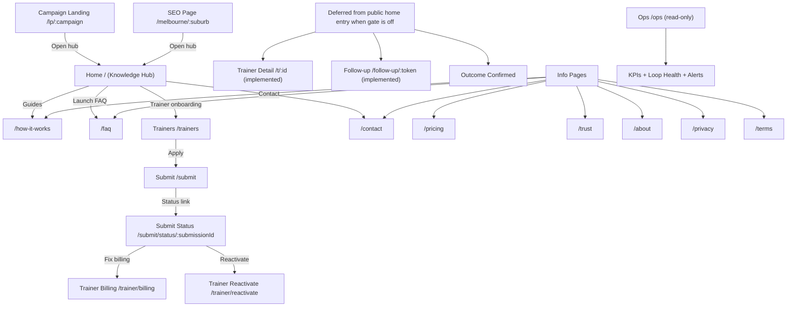

# Complete Website Page Spec

Date: 2026-05-20
Scope: UI/UX completeness contract for all website pages and key interactions.

Current launch mode model (2026-05-20):
1. Public home entry is mode-gated by `PUBLIC_MATCHING_ENABLED`.
2. `PUBLIC_MATCHING_ENABLED=false`: education-first owner waitlist surface is primary on `/`.
3. `PUBLIC_MATCHING_ENABLED=true`: live owner matching surface is primary on `/`.
4. Trainer onboarding remains open in both modes.
5. Matching/contact lifecycle routes and APIs remain implemented in both modes; home entry controls public exposure.

## 1) Is this different from workflows?
Yes.

- This document defines what each page must contain and what users should expect when interacting with it.
- Workflow docs define lifecycle logic across pages, APIs, and system loops.
- Use both together:
  - Page spec = UI completeness.
  - Workflow spec = business/system behavior completeness.

References:
- [USER_WORKFLOWS.md](/Users/carlg/Documents/AI-Coding/dtd/docs/USER_WORKFLOWS.md)
- [WORKFLOW_TRACE_SHEET.md](/Users/carlg/Documents/AI-Coding/dtd/docs/WORKFLOW_TRACE_SHEET.md)

## 2) Global UI contract (all public pages)

Expected on every public page:
1. Shared header and footer.
2. Clear primary action relevant to page intent.
3. Mobile and desktop readable layout.
4. Legal links available (`/privacy`, `/terms`).
5. No dead buttons or dead links.

Component baseline:
1. Shared chrome from `frontend/src/components/PublicChrome.jsx`.
2. Routes defined in `frontend/src/App.js`.
3. Page components from `frontend/src/pages/*`.

## 3) Quick-view wireframe

### Section-level page blocks (quick wireframe)

1. `Home /`
- Header
- Knowledge hub hero/value statement
- Mode status (“prelaunch waitlist” or “matching live”)
- Guides/high-value owner content blocks
- Owner waitlist form (prelaunch mode) or owner match form/results (matching mode)
- Trainer onboarding CTA
- Footer

2. `Trainer Detail /t/:id`
- Header/back
- Trainer profile summary
- Connect form (name/email/phone/context + 2 consents)
- Contact reveal cards
- Follow-up expectation notice
- Footer
- Note: page is implemented; in mode-lock periods it is not the primary public entry path from home.

3. `Submit /submit`
- Header
- Trainer onboarding form
- Consent and billing terms
- Submit CTA
- Result/next-step state
- Footer

4. `Submit Status /submit/status/:submissionId`
- Header
- Status summary
- Blockers/remediation list
- CTAs to billing/reactivation/profile update
- Footer

5. `Trainer Billing /trainer/billing`
- Header
- Billing profile summary
- Issue checklist
- Retry/reconnect/support actions
- Footer

6. `Trainer Reactivate /trainer/reactivate`
- Header
- Inactivity reasons
- Checklist actions (refresh profile, fix billing, reactivate)
- Footer

7. `Follow-up /follow-up/:token`
- Header
- Intro/trainer context
- Outcome buttons (hired/still deciding/new match)
- Confirmation state
- Footer
- Note: route is active and used by outreach flow; it is lifecycle-facing, not a primary nav page.

8. `Campaign /lp/:campaign` + `SEO /melbourne/:suburb`
- Header
- Intent-specific message
- Single strong CTA to Home match flow
- Footer

9. `Info pages`
- Header
- Single focused content section(s)
- Optional return CTA
- Footer/legal links

10. `Ops /ops`
- Auth gate
- Oversight dashboard cards/tables
- Refresh/sign out controls

## 4) Page-by-page complete spec (component-level)

## `/` Home (owner entry)
Purpose: public knowledge hub and launch-status page.

Component file:
- `frontend/src/pages/Home.jsx`

Required sections:
1. Hero/value proposition.
2. Mode status badge (`Prelaunch` or `Matching live`).
3. Practical content/guides blocks.
4. Owner interaction card (waitlist or match form, mode-dependent).
5. CTAs to guides, FAQ, trainers, contact.

Required controls:
1. Guides CTA.
2. Trainer onboarding CTA.
3. FAQ/contact CTAs.

Expected behavior:
1. If `PUBLIC_MATCHING_ENABLED=false`, waitlist submission is primary and direct matching is not exposed from home.
2. If `PUBLIC_MATCHING_ENABLED=true`, owner matching flow runs from home and can route to trainer detail.
3. Trainers can still enter onboarding flow in both modes.

Buttons/CTAs expected:
1. `Explore guides` (or equivalent)
2. `Trainer onboarding` (or equivalent)
3. `Read launch FAQ`
4. `Contact the team`

## `/t/:id` and `/trainers/:id` Trainer detail + connect
Purpose: owner releases contact request and gets trainer contact details.

Component file:
- `frontend/src/pages/TrainerDetail.jsx`

Required sections:
1. Trainer profile summary.
2. Connect form.
3. Post-connect contact card.
4. Follow-up expectation section.

Required controls:
1. Name/email/phone/context fields.
2. Two consent checkboxes.
3. `Connect` button.
4. Contact action buttons or links (`website`, `phone`, `email`).

Expected behavior:
1. Missing required fields or consent blocks connect.
2. Successful connect reveals contact info immediately.
3. Contact action clicks are tracked as engagement signals.
4. Outcome confirmation is deferred to follow-up flow.

Buttons/CTAs expected:
1. `Connect`
2. Contact action links (website/phone/email cards)

## `/how-it-works`
Purpose: explain the phased launch model and current education-first mode.

Component file:
- `frontend/src/pages/HowItWorks.jsx`

Required sections:
1. Soft-launch stage explanation.
2. Current owner value (guides) + next stage (matching).
3. Safety/consent statement.

Required controls:
1. CTA back to home hub (`/`).
2. Secondary CTA for trainers (`/trainers`).

Expected behavior:
1. User understands process before submitting.

## `/trainers`
Purpose: trainer acquisition and qualification entry.

Component file:
- `frontend/src/pages/Trainers.jsx`

Required sections:
1. Commercial model explanation (pay-on-outcome framing).
2. How trainer listing/submission works.
3. What happens after submission.

Required controls:
1. Primary CTA to `/submit`.
2. Support contact path.

Expected behavior:
1. Trainer can decide and start onboarding without ambiguity.

## `/submit`
Purpose: trainer submission and activation start.

Component file:
- `frontend/src/pages/Submit.jsx`

Required sections:
1. Trainer details form.
2. Consent and billing terms section.
3. Submission result state.

Required controls:
1. Form fields for listing profile.
2. Consent checkboxes.
3. Submit button.
4. Link/route to status page on completion.

Expected behavior:
1. Missing consents block submission.
2. Successful submission returns status and next-step path.

## `/submit/status/:submissionId`
Purpose: onboarding completion status and blockers.

Component file:
- `frontend/src/pages/SubmitStatus.jsx`

Required sections:
1. Submission state summary.
2. Billing/profile readiness.
3. Blocker list with remediation links.

Required controls:
1. CTA to update profile (`/submit`).
2. CTA to billing remediation (`/trainer/billing`).
3. Support escalation path.

Expected behavior:
1. Trainer clearly sees what is complete vs blocked.

## `/trainer/billing`
Purpose: billing health and revenue remediation.

Component file:
- `frontend/src/pages/TrainerBilling.jsx`

Required sections:
1. Billing profile summary.
2. Invoice/recovery state summary.
3. Issue class checklist.

Required controls:
1. `Reconnect billing` action.
2. Update profile action.
3. Support contact action.

Expected behavior:
1. Trainer understands billing issue type and next steps.
2. Retry policy/retry-state visibility is present.

## `/trainer/reactivate`
Purpose: trainer reactivation and retention.

Component file:
- `frontend/src/pages/TrainerReactivate.jsx`

Required sections:
1. Current activity/health summary.
2. Reactivation reasons/checklist.
3. Remediation and reactivation actions.

Required controls:
1. `Refresh profile` action.
2. `Fix billing` action.
3. `Reactivate listing` action.

Expected behavior:
1. Trainer can resolve blockers and re-run reactivation path.

## `/follow-up/:token`
Purpose: owner outcome confirmation after outreach.

Component file:
- `frontend/src/pages/FollowUp.jsx`

Required sections:
1. Intro/trainer context.
2. Outcome choices.
3. Confirmation feedback state.

Required controls:
1. `Yes, I hired`.
2. `Still deciding`.
3. `Need another match`.

Expected behavior:
1. Valid token shows context and accepts outcome.
2. Invalid token shows clear error/fallback.

## `/lp/:campaign`
Purpose: campaign landing and demand attribution handoff.

Component file:
- `frontend/src/pages/CampaignLanding.jsx`

Required sections:
1. Campaign-specific value message.
2. CTA into matching flow.

Required controls:
1. Primary CTA to `/` with campaign/source propagation.

Expected behavior:
1. Attribution survives handoff into match request.
2. Campaign/source cohort becomes visible in oversight attribution reporting.

## `/melbourne/:suburb` (SEO page)
Purpose: SEO demand capture for suburb intent.

Component file:
- `frontend/src/pages/SuburbSEO.jsx`

Required sections:
1. Localized copy.
2. CTA to start matching.

Required controls:
1. Primary CTA to `/`.

Expected behavior:
1. Visitor can move directly into match flow.
2. SEO attribution survives CTA handoff into home submissions and nurture reporting.

## `/pricing`, `/trust`, `/faq`, `/about`, `/contact`, `/privacy`, `/terms`
Purpose: informational/legal confidence pages.

Component files:
1. `frontend/src/pages/Pricing.jsx`
2. `frontend/src/pages/Trust.jsx`
3. `frontend/src/pages/FAQ.jsx`
4. `frontend/src/pages/About.jsx`
5. `frontend/src/pages/Contact.jsx`
6. `frontend/src/pages/Privacy.jsx`
7. `frontend/src/pages/Terms.jsx`

Required sections:
1. Clear headline and page purpose.
2. Accurate, current policy/content.
3. Pricing/legal pages must reflect launch billing baseline:
   - first 30 days trial-free for submission-registered trainers.
   - fixed A$5 per valid intro after trial.
4. Relevant CTA back to primary flows where appropriate.

Required controls:
1. Navigation links.
2. Contact method on `/contact`.

Expected behavior:
1. No ambiguous legal or policy language.
2. User can navigate back to action pages without dead-ends.

## `/ops` Oversight (internal)
Purpose: read-only operational visibility.

Component file:
- `frontend/src/pages/Ops.jsx`

Required sections:
1. Auth gate.
2. KPI summary.
3. Loop health.
4. Alerts.
5. Revenue operations detail.

Required controls:
1. Login submit.
2. Refresh.
3. Sign out.

Expected behavior:
1. No mutation controls.
2. Snapshot updates on poll/refresh.

## 5) Completeness checklist

A page set is complete only when:
1. All routes listed above render.
2. All listed controls exist and are clickable.
3. Primary outcomes occur as expected (submit, connect, confirm, remediate).
4. Error states are explicit (invalid token, missing consent, not found).
5. Build passes and critical route smoke checks pass.

## 6) Suggested companion docs

Use this with:
1. [WORKFLOW_TRACE_SHEET.md](/Users/carlg/Documents/AI-Coding/dtd/docs/WORKFLOW_TRACE_SHEET.md) for lifecycle status.
2. [USER_WORKFLOWS.md](/Users/carlg/Documents/AI-Coding/dtd/docs/USER_WORKFLOWS.md) for actor journeys.
3. [ROADMAP.md](/Users/carlg/Documents/AI-Coding/dtd/docs/governance/ROADMAP.md) for launch-gate scope.
