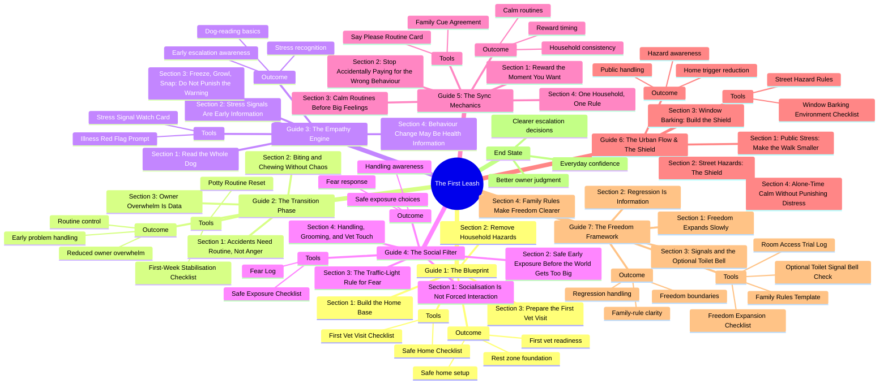

# The First Leash Mindmap

This is the canonical course-structure map for **The First Leash**.

## Course Spine

1. **The Blueprint**
2. **The Transition Phase**
3. **The Empathy Engine**
4. **The Social Filter**
5. **The Sync Mechanics**
6. **The Urban Flow & The Shield**
7. **The Freedom Framework**

## Capability Flow

1. Set up the home well.
2. Stabilise the first routines.
3. Learn what to notice in the dog.
4. Handle fear and exposure more safely.
5. Respond more consistently.
6. Manage public and household stress points.
7. Expand freedom without losing clarity.
