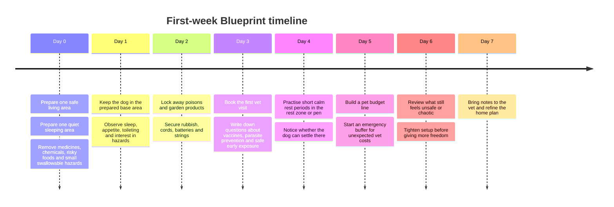

# DTD Module 1 Research Pack

## Executive summary

This report builds a curriculum-ready research pack for **Module 1: The Blueprint** in The First Leash. The module should help a new dog owner make better early decisions about five things only: **safe home setup, household toxins and hazards, rest-zone or crate use, first vet visit preparation, and the first-year cost baseline**. It should not drift into generic puppy blogs, advanced training plans, or medical treatment advice. The strongest usable source base for this pass is **Australia-first**: RSPCA Australia/Knowledgebase, the Australian Animal Poisons Helpline, and ASIC’s MoneySmart; Tier 2 support comes from AVSAB where it clarifies safe confinement, early socialisation timing, reward-based handling, and low-stress veterinary preparation. citeturn28view0turn36view0turn34view0turn25view0turn32view0turn33view0

The best evidence-supported owner messages for Module 1 are straightforward. Before the dog comes home, create one **safe living space** and one **comfortable sleeping area**; remove access to hazards; lock away medicines, chemicals and risky foods; and book the first vet visit rather than waiting for a problem. If poisoning is suspected, do **not** improvise with food, drink or induced vomiting unless a vet or poison service tells you to do so. If you use a crate or pen, treat it as a **safe and secure rest space**, not a punishment box or a substitute for normal exercise and social contact. For budgeting, use cost figures as **dated estimates**, not promises: MoneySmart currently states that the **first year of dog ownership is around AUD 4,000 on average**, with **ongoing annual costs up to AUD 2,520**; those figures should be presented as planning ranges and accompanied by a warning to budget for emergencies. citeturn28view0turn29view0turn36view0turn34view0turn25view0

Compared with the earlier uploaded draft, this pack is cleaner and more defensible. The uploaded material mixed some sound ideas with non-preferred or weak sources, including non-authoritative trainer or magazine-style references outside the agreed source hierarchy. This report replaces that approach with a narrower verified source base and flags the weak material for removal or internal-only use. fileciteturn0file0

## Source base and scope

The scope used here is deliberately narrow. Module 1 is not trying to teach everything about puppies; it is trying to prevent early avoidable mistakes, reduce owner confusion, and establish calm foundations before later modules cover toileting, body language, fear handling, reward timing, and freedom-expansion decisions. That makes the most relevant authorities those that speak to **pet-owner basics, hazards, welfare, triage, vet preparation, and financial planning** rather than trainer blogs or broad lifestyle content. citeturn28view0turn36view0turn25view0

The verified base retrieved for this pass is strong enough to ship an internal Module 1 pack. RSPCA Australia and the RSPCA Knowledgebase provide owner-facing Australian welfare guidance on setting up a safe living space, a comfortable sleeping area, vaccination questions, registration and microchipping, and common household toxins. The Australian Animal Poisons Helpline provides Australia-specific poisoning triage and a list of common poisons encountered in and around the home. MoneySmart provides government-backed financial planning guidance that now includes pet-cost planning. AVSAB is used only as Tier 2 support where it helps clarify that safe puppy pens or crates can function as rest spaces and that veterinary handling should aim to reduce stress rather than force compliance. citeturn5view2turn28view0turn36view0turn34view0turn25view0turn32view0turn33view0

Two target authorities named in the brief were **not reliably retrievable for direct Module 1 citation in this run**: the Australian Veterinary Association and Animal Welfare Victoria. RSPCA’s vaccination page explicitly states that its general vaccination information is based on the 2024 WSAVA guidelines and advice from the **Australian Veterinary Association**, which is sufficient to support Module 1’s website wording about asking a local vet for an individualised vaccination and socialisation plan; however, the AVA primary page itself should still be added in a follow-up source pass once it can be fetched directly. citeturn28view1

## Source list

### Verified sources

| Title | Organisation / author | URL | Date accessed | Source tier |
|---|---|---|---|---|
| How do I care for my new dog or puppy? citeturn4view1 | RSPCA Australia | `https://www.rspca.org.au/latest-news/blog/how-do-i-care-my-new-dog-or-puppy/` | 2026-07-05 | Tier 1 Australian welfare |
| How can I toilet train my puppy or adult dog? citeturn7view1 | RSPCA Knowledgebase | `https://kb.rspca.org.au/categories/companion-animals/dogs/caring-for-my-dog/how-can-i-toilet-train-my-puppy-or-adult-dog` | 2026-07-05 | Tier 1 Australian welfare |
| Is socialising my puppy important? citeturn7view2 | RSPCA Knowledgebase | `https://kb.rspca.org.au/categories/companion-animals/dogs/puppies/is-socialising-my-puppy-important` | 2026-07-05 | Tier 1 Australian welfare |
| What should I do when I bring home a new puppy? citeturn28view0 | RSPCA Knowledgebase | `https://kb.rspca.org.au/categories/companion-animals/dogs/puppies/what-should-i-do-when-i-bring-home-a-new-puppy` | 2026-07-05 | Tier 1 Australian welfare |
| What vaccinations should my dog receive? citeturn28view1 | RSPCA Knowledgebase | `https://kb.rspca.org.au/categories/companion-animals/dogs/caring-for-my-dog/what-vaccinations-should-my-dog-receive` | 2026-07-05 | Tier 1 Australian welfare |
| RSPCA Policy A8 Housing and environmental needs of companion animals citeturn29view0 | RSPCA Australia | `https://kb.rspca.org.au/categories/rspca-policy/a-companion-animals/rspca-policy-a8-housing-and-environmental-needs-of-companion-animals` | 2026-07-05 | Tier 1 Australian welfare policy |
| Household and Garden Dangers category page citeturn35view0 | RSPCA Knowledgebase | `https://kb.rspca.org.au/categories/companion-animals/household-and-garden-dangers` | 2026-07-05 | Tier 1 Australian welfare |
| What are common household dangers for pets? citeturn36view0 | RSPCA Knowledgebase | `https://kb.rspca.org.au/categories/companion-animals/household-and-garden-dangers/what-are-common-household-dangers-for-pets` | 2026-07-05 | Tier 1 Australian welfare |
| What are the risks to my cat or dog from rat bait? citeturn36view2 | RSPCA Knowledgebase | `https://kb.rspca.org.au/categories/companion-animals/household-and-garden-dangers/what-are-the-risks-to-my-cat-or-dog-from-rat-bait` | 2026-07-05 | Tier 1 Australian welfare |
| Animal Poisons Helpline home page citeturn4view3turn34view2 | Australian Animal Poisons Helpline | `https://www.animalpoisons.com.au/` | 2026-07-05 | Tier 1 Australian poison authority |
| Common Poisons for Dogs and Cats citeturn12view0turn34view1 | Australian Animal Poisons Helpline | `https://www.animalpoisons.com.au/common-poisons/` | 2026-07-05 | Tier 1 Australian poison authority |
| Pet Poisoning Emergency Instructions | What to Do Fast citeturn12view2turn34view0 | Australian Animal Poisons Helpline | `https://www.animalpoisons.com.au/emergency-instructions/` | 2026-07-05 | Tier 1 Australian poison authority |
| Getting a pet citeturn23view0turn25view0 | MoneySmart / ASIC | `https://moneysmart.gov.au/family-and-relationships/getting-a-pet` | 2026-07-05 | Tier 1 Australian government guidance |
| Pet insurance citeturn23view1turn25view1 | MoneySmart / ASIC | `https://moneysmart.gov.au/add-on-insurance/pet-insurance` | 2026-07-05 | Tier 1 Australian government guidance |
| AVSAB Position Statement on Puppy Socialization citeturn32view0 | American Veterinary Society of Animal Behavior | `https://avsab.org/wp-content/uploads/2019/01/Puppy-Socialization-Position-Statement-FINAL.pdf` | 2026-07-05 | Tier 2 veterinary behaviour authority |
| AVSAB Position Statement on Positive Veterinary Care citeturn33view0 | American Veterinary Society of Animal Behavior | `https://avsab.org/wp-content/uploads/2024/12/Positive-Veterinary-Care-Position-Statement-download.pdf` | 2026-07-05 | Tier 2 veterinary behaviour authority |
| AVSAB Position Statement on Humane Dog Training citeturn33view1 | American Veterinary Society of Animal Behavior | `https://avsab.org/wp-content/uploads/2024/12/AVSAB-Humane-Dog-Training-Position-Statement-2021.pdf` | 2026-07-05 | Tier 2 veterinary behaviour authority |

### Targeted but pending retrieval

| Target source | Status | URL |
|---|---|---|
| Australian Veterinary Association puppy socialisation / vaccination policy | Direct retrieval not verified in this run. Use RSPCA vaccination article as interim Australia-first support because it explicitly states it is based on WSAVA guidance and advice from the AVA. citeturn28view1 | `TODO: verify current AVA policy URL via site navigation` |
| Animal Welfare Victoria dog-owner guidance relevant to registration / ownership basics | Direct Module 1 page not verified in this run. Not required for this pack to proceed, but should be added in a follow-up pass if a suitable pet-owner guidance page is found. | `TODO: verify current Animal Welfare Victoria URL via site navigation` |

## Research notes

### Safe home setup

**Module:** Module 1 — The Blueprint  
**Topic:** Safe home setup  
**Source:** RSPCA Australia, “How do I care for my new dog or puppy?”; RSPCA Knowledgebase, “What should I do when I bring home a new puppy?”; RSPCA Policy A8 Housing and environmental needs of companion animals. citeturn5view2turn28view0turn29view0  
**Source type:** Australian animal-welfare guidance and policy.  
**Governance objective supported:** Reduce owner confusion; prevent accidental escalation; build calm routines.  
**Owner situation:** A puppy or newly adopted dog is arriving home and the owner is trying to set the house up safely without causing overwhelm or preventable accidents.  
**What the owner needs to notice:** The dog needs one safe living area to settle in, one comfortable sleeping area to retreat to, and a home environment where dangerous items are not accessible. The environment should support comfort, safety, shelter, cleanliness, privacy, enrichment and appropriate freedom, not just physical containment. citeturn5view2turn28view0turn29view0  
**Common mistake:** Either giving the dog too much freedom too soon, or treating confinement as the whole solution instead of creating a calm, safe, enriched setup. citeturn28view0turn29view0  
**Better decision rule:** Set up one small, safe base area first. Make it comfortable, low-stimulation and secure. Expand freedom later, once the dog is settling and the environment is safe. citeturn5view2turn28view0  
**What to do next:** Prepare a living space and sleeping area before day one. Remove or secure hazards, provide soft bedding, toys, water, and a calm area where the dog can rest without constant traffic. citeturn5view2turn28view0  
**When education is not enough:** If the dog cannot settle at all, shows sudden behavioural change, becomes distressed in the resting area, or the owner cannot keep the environment safe without constant conflict, a vet and then trainer conversation may be needed. RSPCA also advises seeking expert advice, such as from a veterinarian, before and after bringing a puppy home. citeturn28view0turn29view0  
**What to tell a vet or trainer:** Describe the setup, where the dog sleeps, what hazards or behaviours keep recurring, what times the dog struggles most, and what changes happened before the problem started.  
**Website-ready wording:** *Create one safe base area first. Your dog needs a calm place to settle, sleep and stay safe while they learn the home.*  
**Internal notes:** This topic should stay practical: one safe area, one sleep area, hazard removal, gradual freedom. Do not turn it into a shopping guide or brand review. RSPCA Policy A8 is especially useful for guarding against over-confinement language. citeturn29view0

### Household toxins and hazards

**Module:** Module 1 — The Blueprint  
**Topic:** Household toxins and hazards  
**Source:** RSPCA Knowledgebase, “What are common household dangers for pets?”; RSPCA Knowledgebase, “What are the risks to my cat or dog from rat bait?”; Animal Poisons Helpline, “Common Poisons for Dogs and Cats”; Animal Poisons Helpline, “Emergency Instructions”. citeturn36view0turn36view2turn34view1turn34view0  
**Source type:** Australian animal-welfare guidance and Australian poison-triage guidance.  
**Governance objective supported:** Prevent accidental escalation; improve owner judgment; identify when veterinary support is needed.  
**Owner situation:** The owner is puppy-proofing the house or discovers the dog chewing, licking, swallowing, or investigating something unsafe.  
**What the owner needs to notice:** Many ordinary household items can be toxic or mechanically dangerous to dogs, including medicines, pesticides, rodenticide, slug bait, some foods, xylitol, batteries, magnets, rising dough, alcohol, strings and toxic plants. Some exposures are life-threatening and a few, such as rodenticide or snake bite, may not look serious immediately. citeturn36view0turn34view2turn34view0  
**Common mistake:** Waiting for symptoms, trying home fixes first, offering food or drink after a suspected ingestion, or inducing vomiting without professional advice. citeturn34view0  
**Better decision rule:** If there may have been a toxic exposure, secure the dog, remove further access, keep packaging or product details, and call a vet or the Animal Poisons Helpline before improvising. citeturn36view0turn34view0  
**What to do next:** Lock medicines, garden chemicals and cleaning products away; keep risky foods out of reach; secure bins; remove small swallowable objects; and contact a vet or poison service immediately if exposure is suspected. The Helpline advises not to induce vomiting unless told to do so by a vet or poison expert. citeturn36view0turn34view0turn34view2  
**When education is not enough:** Immediately, if poisoning is suspected. This is a vet-or-poison-service scenario, not a self-guided training issue. Signs may include vomiting, lethargy, diarrhoea, wobbliness, seizures, abdominal pain, drooling, refusal to eat, bleeding, or breathing change, depending on the exposure. citeturn34view0turn34view2turn36view0  
**What to tell a vet or trainer:** Tell the vet exactly what the dog may have contacted or swallowed, the estimated amount, the time, the dog’s weight if known, and any signs already seen. A trainer only becomes relevant later if repeated scavenging or access-management problems keep occurring once the medical risk is dealt with. citeturn34view0turn34view2  
**Website-ready wording:** *Common foods, medicines, garden products and small objects can seriously harm dogs. If your dog may have eaten one, call a vet or the Animal Poisons Helpline first and do not try home remedies.*  
**Internal notes:** Keep website wording highly practical and conservative. Avoid detailed toxicology mechanisms except where needed internally. Use Australian helpline contact details in the gated tools/checklist, not necessarily in every lesson sentence. citeturn34view0turn34view2

### Rest zone and crate use

**Module:** Module 1 — The Blueprint  
**Topic:** Rest zone and crate use  
**Source:** RSPCA Knowledgebase, “What should I do when I bring home a new puppy?”; RSPCA Policy A8 Housing and environmental needs of companion animals; AVSAB Position Statement on Puppy Socialization. citeturn28view0turn29view0turn32view0  
**Source type:** Australian animal-welfare guidance and veterinary behaviour position statement.  
**Governance objective supported:** Build calm routines; prevent accidental escalation; improve owner judgment.  
**Owner situation:** The owner wants to use a crate, pen or small area so the puppy can rest and stay safe when full supervision is not possible.  
**What the owner needs to notice:** Rest spaces should feel safe, accessible and comfortable. AVSAB states that safe places such as crates or puppy pens can support naps and help puppies learn to amuse themselves, and that proper confinement training can provide secure places for rest and short-term confinement. RSPCA policy adds that companion animals should not be confined in ways that significantly restrict movement and social contact for prolonged periods. citeturn32view0turn29view0turn28view0  
**Common mistake:** Using confinement as the main answer to every problem, leaving a young dog confined too long, or setting up a rest area that is noisy, uncomfortable or stressful. citeturn29view0turn28view0  
**Better decision rule:** Use the rest zone proactively as a calm, safe base. Pair it with bedding, toys, predictability and normal welfare needs. If the dog is distressed, do not just increase confinement; review comfort, duration, routine and support. citeturn32view0turn29view0  
**What to do next:** Set up a pen or crate only if it can operate as a safe resting place. Keep it comfortable, dry, and away from intense household traffic. Use brief, calm periods first and support the dog to rest there rather than forcing long stretches too quickly. citeturn28view0turn32view0  
**When education is not enough:** If the dog panics, injures itself, cannot settle, or develops severe distress around short separations or confinement, this moves beyond simple setup advice and may need trainer or veterinary-behaviour input. AVSAB also notes that puppies displaying fear should receive veterinary guidance. citeturn32view0turn33view0  
**What to tell a vet or trainer:** Explain how the rest area is set up, how long the dog is there, what the dog does in it, whether distress starts immediately or after a delay, and whether rest improves anywhere else in the house.  
**Website-ready wording:** *A crate or pen should work as a safe rest space, not a punishment box. Start small, keep it comfortable, and watch how your dog feels in it.*  
**Internal notes:** Avoid promising crate training results. Avoid lecturing on crate ideology. The core DTD point is judgment: “Is this helping the dog settle, or just containing a problem?” citeturn32view0turn29view0

### First vet visit preparation

**Module:** Module 1 — The Blueprint  
**Topic:** First vet visit preparation  
**Source:** RSPCA Australia, “How do I care for my new dog or puppy?”; RSPCA Knowledgebase, “What should I do when I bring home a new puppy?”; RSPCA Knowledgebase, “What vaccinations should my dog receive?”; AVSAB Position Statement on Positive Veterinary Care. citeturn5view4turn28view0turn28view1turn33view0  
**Source type:** Australian animal-welfare guidance plus veterinary behaviour position statement.  
**Governance objective supported:** Reduce owner confusion; identify when education is not enough; prepare owners for expert support.  
**Owner situation:** The owner has just brought the dog home and needs to know what to book, what to ask, and what observations to bring.  
**What the owner needs to notice:** Early vet conversations should cover vaccination timing, parasite prevention, lifestyle risks, microchipping, registration and broader preventive health care. RSPCA’s vaccination guidance makes clear that vaccine choices and timing depend on the dog’s location, lifestyle and individual risk; it also states that appropriate socialisation is still important before puppies are fully vaccinated and that local vets should advise on safe exposure. AVSAB’s Positive Veterinary Care guidance adds that stress at the vet can begin before arrival and that owners benefit from learning signs of fear and helping create more positive visits. citeturn5view4turn28view0turn28view1turn33view0  
**Common mistake:** Waiting until something goes wrong, assuming all puppies follow one standard vaccine and risk plan, or pushing through fright without noticing the dog’s stress. citeturn28view1turn33view0  
**Better decision rule:** Book the first visit early, bring your questions, and ask your vet for an individualised plan based on your dog, your area and your household. Watch the dog’s stress level as part of the visit, not as an afterthought. citeturn28view0turn28view1turn33view0  
**What to do next:** Prepare a short list of questions: vaccine schedule, local disease risks, worming and parasite control, safe early socialisation, microchip and registration status, diet transition, and any early concerns about sleep, appetite, toileting, chewing, vomiting, diarrhoea or fear. Use treats and calm handling if the clinic supports them, and ask how to make future visits easier. citeturn5view4turn28view0turn28view1turn33view0  
**When education is not enough:** If behaviour changes suddenly, the puppy seems unwell, there is vomiting, diarrhoea, lethargy, pain, defensive handling, or suspected toxic exposure, vet advice comes before training advice. citeturn34view0turn28view0turn33view0  
**What to tell a vet or trainer:** Tell the vet what has changed, when it started, what the dog ate or contacted, vaccine history if known, stool quality, toileting pattern, sleep pattern, appetite and any fear signals during handling or travel. If help later escalates to a trainer, keep the same observations.  
**Website-ready wording:** *Book the first vet visit early. Ask for a local plan on vaccines, parasite prevention, safe early exposure and anything unusual you have noticed at home.*  
**Internal notes:** Keep desexing as an “ask your vet” question, not as core educational advice. Keep socialisation as a short vet discussion point here and teach it fully in Module 4. citeturn28view1

### First-year cost baseline

**Module:** Module 1 — The Blueprint  
**Topic:** First-year cost baseline  
**Source:** MoneySmart, “Getting a pet”; MoneySmart, “Pet insurance”. citeturn25view0turn25view1  
**Source type:** Australian government financial guidance.  
**Governance objective supported:** Reduce owner confusion; build calm routines; identify when education is not enough.  
**Owner situation:** The owner is excited about the dog but has not yet planned for the full cost of food, vet care, prevention, supplies and unexpected bills.  
**What the owner needs to notice:** Pet ownership is a financial commitment as well as a care commitment. MoneySmart currently states that a dog costs **around AUD 4,000 on average in the first year**, with **ongoing annual costs up to AUD 2,520**, and that illness or injury can add fast unexpected costs. It also notes that costs vary by breed, size, health risk and lifestyle. citeturn25view0  
**Common mistake:** Budgeting only for the purchase or adoption fee, or assuming vet costs will be minor and predictable. citeturn25view0turn25view1  
**Better decision rule:** Treat first-year costs as a planning range, not a single number. Build a simple pet line into the household budget and plan separately for unexpected vet costs. citeturn25view0turn25view1  
**What to do next:** Note estimated recurring categories such as food, vet services, parasite prevention, accessories, grooming or training, and possible boarding or transport. Start an emergency fund and, if considering insurance, compare policies carefully and read the PDS because cover, exclusions, benefit caps and waiting periods vary. citeturn25view0turn25view1  
**When education is not enough:** If care is becoming financially unstable, the owner is delaying necessary vet care, or the household cannot absorb even moderate urgent costs, the issue is no longer just “organisation”; it affects welfare and should be acknowledged directly. MoneySmart notes that owners may defer check-ups, vaccinations or medication when affordability is tight. citeturn25view1  
**What to tell a vet or trainer:** Be honest about budget limits. MoneySmart explicitly advises being upfront with vets about what you can afford and asking about payment options. If a trainer is later contacted, knowing what has and has not been financially feasible will improve planning. citeturn25view0  
**Website-ready wording:** *Dogs cost more than the adoption or purchase fee. Plan for routine care and keep a buffer for the bills you cannot predict.*  
**Internal notes:** Cost figures must be dated and framed as estimates. Avoid telling owners to buy insurance; present it as one planning option with important exclusions and waiting periods. citeturn25view1

## Claim register

| Claim | Module | Source | Source tier | Evidence strength | Website-safe wording | Risk | Action |
|---|---|---|---|---|---|---|---|
| New dogs need a safe living area and a comfortable sleeping area when they arrive home. | Module 1 | RSPCA Australia new-dog page; RSPCA new-puppy page citeturn5view2turn28view0 | Tier 1 | Strong | *Set up one safe area and one quiet sleep space before day one.* | Low | Keep |
| Companion animals should not be confined in a way that significantly restricts movement and social contact for prolonged periods. | Module 1 | RSPCA Policy A8 citeturn29view0 | Tier 1 | Strong | *Use confinement for safety and rest, not as a long-term substitute for normal care.* | Low | Keep |
| Safe pens or crates can be used as places for naps and secure short-term confinement. | Module 1 | AVSAB Puppy Socialization statement citeturn32view0 | Tier 2 | Moderate to strong | *A crate or pen can help if it functions as a safe rest space.* | Moderate; international source | Keep with plain wording |
| Many common household items such as food, plants and medicines can be toxic or even fatal to pets. | Module 1 | RSPCA household dangers page citeturn36view0 | Tier 1 | Strong | *Normal household items can seriously harm dogs. Keep them out of reach.* | Low | Keep |
| Xylitol can cause dangerous hypoglycaemia, seizures, death, and in some dogs liver failure. | Module 1 | RSPCA household dangers page citeturn36view0 | Tier 1 | Strong | *Xylitol is dangerous to dogs. If your dog may have eaten it, contact a vet immediately.* | Moderate if phrased too clinically | Keep, simplify |
| Do not induce vomiting after poisoning unless told to do so by a vet or the Animal Poisons Helpline. | Module 1 | Animal Poisons Helpline emergency instructions citeturn34view0 | Tier 1 | Strong | *Do not try home remedies after a suspected poisoning. Call first.* | Low | Keep |
| Rat bait can cause delayed, life-threatening bleeding and pets may look well for days before signs appear. | Module 1 | Animal Poisons Helpline home/common-poisons pages; RSPCA household dangers category citeturn34view2turn35view0 | Tier 1 | Strong | *If your dog may have eaten rat bait, don’t wait for symptoms.* | Low | Keep |
| Puppies should receive appropriate socialisation before they are fully vaccinated, with precautions and vet advice. | Module 1 / Module 4 bridge | RSPCA vaccinations; AVSAB Puppy Socialization statement citeturn28view1turn32view0 | Tier 1 + Tier 2 | Strong | *Ask your vet how to balance vaccination safety with early exposure in your area.* | Moderate module-scope drift | Keep as Module 1 vet question only |
| First-year dog ownership in Australia is around AUD 4,000 on average, with ongoing annual costs up to AUD 2,520. | Module 1 | MoneySmart getting-a-pet page citeturn25view0 | Tier 1 | Moderate to strong | *Australian estimates suggest dogs can cost several thousand dollars in the first year.* | Estimate may date quickly; varies by household | Keep as dated estimate/range |
| Owners should budget separately for unexpected vet costs and may consider an emergency fund and, optionally, insurance. | Module 1 | MoneySmart getting-a-pet page; MoneySmart pet-insurance page citeturn25view0turn25view1 | Tier 1 | Strong | *Plan for routine costs and keep a buffer for the costs you cannot predict.* | Low | Keep |
| Stress at the vet can begin before arrival; positive handling and calmer visits matter. | Module 1 | AVSAB Positive Veterinary Care statement citeturn33view0 | Tier 2 | Moderate | *Notice your dog’s stress at the clinic and ask how to make visits easier.* | International source | Keep as supporting note |
| Reward-based training is the humane default; common issues can often be helped by arranging the environment and reinforcing desirable behaviour. | Module 1 / broader governance | AVSAB Humane Dog Training statement; RSPCA training guidance citeturn33view1turn28view0 | Tier 2 + Tier 1 | Strong | *Set the dog up to succeed rather than waiting to correct mistakes.* | Low | Keep |

## Website-ready cards and first-week timeline

These are the distilled owner-facing outputs, written for mobile-first delivery and aligned to the locked lesson anatomy. They should appear as concise cards inside Module 1, not as long articles. Each card is based only on the verified source base above. citeturn28view0turn36view0turn34view0turn25view0

### Safe home setup card

**Scenario:** You are bringing your dog home today and want to avoid chaos from the first night.  
**What to notice:** Your dog needs one safe base area and one quiet place to sleep. citeturn5view2turn28view0  
**Common mistake:** Giving full access to the house before the dog has settled. citeturn28view0  
**Better decision rule:** Start small. Make one area safe, calm and easy to supervise. citeturn5view2turn29view0  
**What to do now:** Set up bedding, water, a chew or toy, and remove anything dangerous from reach. citeturn28view0turn36view0  
**Watch for this:** If the dog cannot settle anywhere, note when and where that happens.  
**When to seek help:** If the dog seems unwell, panicked, suddenly different, or cannot rest at all. citeturn28view0turn33view0  
**Trainer-readiness prompt:** *Where does your dog settle best, and when do problems happen most?*

### Household toxins and hazards card

**Scenario:** Your dog mouths, chews or steals everyday items around the house or garden.  
**What to notice:** Medicines, rat bait, slug bait, some foods, xylitol, batteries, magnets, string and some plants can all be dangerous. citeturn36view0turn34view1  
**Common mistake:** Waiting to “see what happens” or trying home fixes first. citeturn34view0  
**Better decision rule:** Remove access first and call a vet or the Animal Poisons Helpline before improvising. citeturn34view0turn34view2  
**What to do now:** Lock hazards away, secure rubbish, and keep the product packet if exposure is possible. citeturn36view0  
**Watch for this:** Vomiting, wobbliness, diarrhoea, bleeding, drooling, seizures or unusual tiredness. citeturn34view2turn36view0  
**When to seek help:** Immediately, if poisoning is suspected. citeturn34view0  
**Trainer-readiness prompt:** *If this keeps happening, note what your dog can access and when scavenging starts.*

### Rest zone or crate card

**Scenario:** You need your dog to rest safely when you cannot supervise every second.  
**What to notice:** A rest zone should help your dog feel secure enough to settle. citeturn32view0turn28view0  
**Common mistake:** Using the crate or pen as the whole solution, or expecting long confinement too soon. citeturn29view0turn32view0  
**Better decision rule:** Use the space for short, calm rest and safety, not punishment. The goal is comfort and predictability. Supported by welfare guidance on comfort, safety and appropriate temporary confinement. citeturn29view0turn32view0  
**What to do now:** Keep the area comfortable, quiet and easy to access. Start with brief calm periods. citeturn28view0turn32view0  
**Watch for this:** If the dog is frantic, shuts down, or never relaxes there. citeturn33view0turn32view0  
**When to seek help:** If distress escalates or the dog cannot cope with short separations or short confinement. citeturn32view0turn33view0  
**Trainer-readiness prompt:** *How long can your dog rest there before stress starts?*

### First vet visit card

**Scenario:** Your dog is home, and you want to be ready for the first vet appointment.  
**What to notice:** Your vet should help you build an individual plan, not just give generic steps. citeturn28view1turn28view0  
**Common mistake:** Waiting for a problem or assuming all dogs need the same plan. citeturn28view1  
**Better decision rule:** Book early, bring questions, and ask how to make visits low-stress. citeturn28view1turn33view0  
**What to do now:** Ask about vaccines, worming, parasite prevention, microchip and registration status, safe early exposure, and any odd behaviour you have noticed. citeturn28view0turn28view1  
**Watch for this:** Fear during travel or handling, vomiting, diarrhoea, poor appetite, pain, or sudden behaviour change. citeturn33view0turn28view0  
**When to seek help:** Vet first if the dog seems unwell or suddenly different. citeturn34view0turn28view0  
**Trainer-readiness prompt:** *Write down what changed, when it started and what happens just before it.*

### First-year cost baseline card

**Scenario:** You are trying to work out what dog ownership will really cost.  
**What to notice:** The purchase or adoption fee is only one part of the cost. citeturn25view0  
**Common mistake:** Budgeting for food and toys only. citeturn25view0turn25view1  
**Better decision rule:** Plan for routine care and a separate emergency buffer. citeturn25view0turn25view1  
**What to do now:** Add pet costs to your budget: food, vet care, parasite prevention, accessories, training or grooming, and backup care if you travel. citeturn25view0  
**Watch for this:** Cost stress can delay needed care. Money should be part of the setup conversation, not something hidden until a crisis. citeturn25view1  
**When to seek help:** If the household is already delaying necessary care, be upfront with the vet about budget constraints. citeturn25view0  
**Trainer-readiness prompt:** *What care is routine, what is optional, and what would become difficult in an emergency?*

### First-week setup timeline

This timeline turns the research into a simple first-week sequence: create the base area, remove hazards, book the vet, begin calm rest habits, and set the budget baseline early rather than after the first scare or first unexpected bill. It synthesises the RSPCA, Animal Poisons Helpline and MoneySmart guidance. citeturn28view0turn36view0turn34view0turn25view0

## Source-quality audit

The earlier uploaded draft is useful as a reminder of the problem this process is solving: it blended some reasonable ideas with sources that are outside the preferred hierarchy, not clearly authoritative, or unsuitable as primary evidence for DTD curriculum decisions. In that draft, Module 1 relied partly on **ASPCA** and on less clearly verifiable references such as **“Homeward Bound Puppy Booklet / Pediatric Canine Ethology and Behavioral Development”**, while later modules introduced weak or commercial sources such as **Psychology Today, The Pet Spot, Ruff Translation, Just Labs Magazine, Meowant, Carol’s Canine Training, Dogington Post, and Good Dog**. Those may be useful for rough idea discovery, but they should not be the evidence base for DTD’s core owner curriculum. fileciteturn0file0

For Module 1 specifically, the source-quality decision is clear. Keep **RSPCA Australia/Knowledgebase**, **Australian Animal Poisons Helpline**, and **MoneySmart** as the Tier 1 backbone. Keep **AVSAB** only where it adds a missing but important welfare or behaviour angle, such as safe puppy socialisation before full vaccination, positive vet visits, and the principle that crates and pens should function as safe rest spaces rather than coercive containment. Everything else should be treated as replaceable unless it is later matched to a stronger primary source. citeturn28view0turn36view0turn34view0turn25view0turn32view0turn33view0

The specific actions for weak or uncertain material are these. **Remove from curriculum evidence:** trainer blogs, commercial pet-content magazines, generic lifestyle sites, and any source without clear veterinary/welfare authorship. **Move to internal-only idea pool:** broad conceptual prompts such as “puppy blues” language if they help topic planning but are not needed for Module 1’s public-facing copy. **Retain only if replaced:** cost claims that rely on media summaries rather than primary or government-backed pages; behavioural or medical advice that is not tied to a veterinary, welfare, or poison authority. **Keep but simplify:** any strong claim that is currently true but too technical for owners, such as xylitol-induced hypoglycaemia or the delayed presentation of rodenticide poisoning. fileciteturn0file0turn36view0turn34view2turn25view0

## Next steps

This pack is ready to convert into three repo-ready artefacts. The first is an **internal research file** holding the verified notes above. The second is a **claim register** with dates and wording controls, especially for cost, poison and vaccination language. The third is a **Module 1 curriculum draft** with one overview, three concise lessons, and one or two tools: at minimum a **Safe Home Checklist** and a **First Vet Visit Checklist**. The website layer should not expose source notes, academic detail or long medical explanations; it should expose only decision rules, today’s actions, escalation prompts and short cards like the ones above. citeturn28view0turn36view0turn34view0turn25view0

A short follow-up retrieval pass should still be scheduled for two gaps: direct **AVA** primary-page verification and a relevant **Animal Welfare Victoria** owner-guidance page if one can be fetched cleanly. Neither gap blocks Module 1, because the current pack already has sufficient Tier 1 support from RSPCA, the Animal Poisons Helpline and MoneySmart, with carefully limited AVSAB supplementation. The blocking rule for publication remains the same: every learner-facing claim must trace to a verified source and be rewritten in calm, plain English. citeturn28view1turn25view0turn34view0
